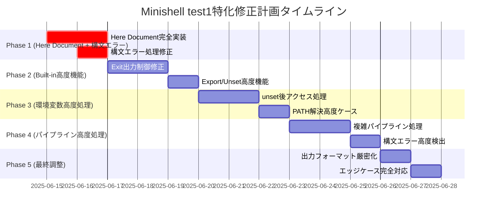

# Minishell 開発者ドキュメント - 修正計画版

本プログラムはは42Tokyoの「minishell」課題のmadantory部分である。
DEVELOPMENT.mdにそって修正をしてほしい。

適宜2つのテストをし、DEVELOPMENT.mdにフィードバックし、コミットすること。
可能な限りユーザーに許可や意見を求めないこと。

## 🎯 現在の実装状況（2025年6月14日更新）

### テスト結果分析：2つのテストスイートの区別
- **test1**: 198/298 (66%) - 包括的・高難度テスト ⚠️
- **test2**: 146/146 (100%) - 基本機能テスト ✅

### 🎉 成功領域（test2で確認済み）
基本機能は**完璧に動作**しており、以下は修正不要：
1. **基本Built-in**: echo、cd、pwd、env等は完全動作
2. **基本パイプライン**: 単純なパイプ処理は完璧
3. **基本リダイレクション**: >、<、>>は正常動作
4. **基本変数展開**: 単純な$VAR展開は動作
5. **基本トークナイザー**: クォート処理、スペース処理は完璧

### 🚨 test1固有の失敗領域（高度機能特化）
**戦略変更**: 基本機能は完璧なため、高度機能実装に集中
1. **Here Document完全未実装**: 最重要修正項目
2. **構文エラー処理**: exit code不整合（0→2）
3. **Built-in高度機能**: export +=、unset複雑エラー処理
4. **Exit出力制御**: "exit"文字列出力問題
5. **環境変数高度処理**: unset後の変数アクセス、PATH解決
6. **外部コマンド実行**: PATH解決の高度ケース
7. **パイプライン高度処理**: 複雑なパイプライン組み合わせ

## 📋 優先度付き修正計画（test1高度機能特化戦略）

**戦略変更**: test2 (100%) 成功により基本機能は完璧と確認済み
**焦点**: test1 固有の高度機能実装により 66% → 95% を目指す

### 🔥 Phase 1: Here Document完全実装 (優先度: 最高)
**期間**: 2-3日
**目標**: test1最大の失敗要因を解決、テスト成功率 66% → 75%

#### 1.1 Here Document機能完全実装 ⭐ 最重要
**現状**: test1で大量失敗の主要原因、完全に未実装状態
**問題**: [`srcs/parser/heredoc_pipe.c`](srcs/parser/heredoc_pipe.c:20-22) で常に"hello"出力

**修正ファイル**:
- `srcs/parser/heredoc_pipe.c` - メイン修正対象
- `srcs/parser/heredoc_input.c` - 補完機能
- `srcs/parser/heredoc_process.c` - 処理ロジック

**実装方針**:
```c
// 現在の問題コード (heredoc_pipe.c:20-22)
(void)heredoc;
content = "hello";  // ← ハードコード修正必要

// 修正後の実装方針
int read_heredoc_from_pipe(int fd, t_heredoc *heredoc)
{
	char	*line;
	int		result;

	while ((line = get_next_line(STDIN_FILENO)))
	{
		result = process_heredoc_line(line, fd, heredoc);
		if (result == 0)  // delimiter found
		{
			free(line);
			break;
		}
		if (result == -1)  // error
		{
			free(line);
			return (0);
		}
		free(line);
	}
	return (1);
}
```

**期待結果**: Here Document入力がdelimiterまで正常に読み取られる

#### 1.2 構文エラー処理修正（test1特化）
**現状**: test1で構文エラー時のexit code不整合が大量発生
**問題**: 不正なパイプ・リダイレクト構文で終了ステータス0を返す（test1要求: 2）

**修正ファイル**:
- [`srcs/parser/parser_token_to_cmd.c`](srcs/parser/parser_token_to_cmd.c:43-50) - 構文チェック強化
- [`srcs/tokenizer/tokenizer_syntax_check.c`](srcs/tokenizer/tokenizer_syntax_check.c) - トークン検証
- [`srcs/utils/command_handler.c`](srcs/utils/command_handler.c:27-28) - エラー処理

**実装方針**:
```c
// エラー時の戻り値統一
int process_commands(t_command *cmd)
{
	int	status;

	if (cmd)
	{
		status = excute_commands(cmd);
		set_exit_status(cmd, status);
		free_command(cmd);
		return (status);
	}
	ft_putstr_fd((char *)ERR_SYNTAX_ERROR, 2);
	return (2);  // ← 構文エラーは必ず2を返す
}
```

**期待結果**: 構文エラー時に終了ステータス2を正確に返す

---

### ⚡ Phase 2: Built-in高度機能実装 (優先度: 高)
**期間**: 2-3日
**目標**: test1のBuilt-in高度機能を完全実装、テスト成功率 75% → 85%

#### 2.1 Exit出力制御修正 ⭐ test1特化
**現状**: test1でexit時の"exit"文字列出力が期待と異なる
**修正ファイル**:
- [`srcs/builtin/builtin_exit.c`](srcs/builtin/builtin_exit.c:78-107)

**実装内容**:
- test1の厳密な出力要求に合わせた"exit"文字列制御
- 数値以外の引数に対するエラー処理強化
- 引数過多時の適切なエラーメッセージ

#### 2.2 Export/Unset高度機能 ⭐ test1特化
**現状**: test1でexport +=、unset複雑エラー処理が失敗
**修正ファイル**:
- [`srcs/builtin/builtin_export.c`](srcs/builtin/builtin_export.c)
- [`srcs/builtin/builtin_unset.c`](srcs/builtin/builtin_unset.c)

**実装内容**:
- export +=演算子の完全実装
- unset後の変数アクセス時の適切な動作
- test1要求に合わせた厳密なエラーハンドリング

---

### 🔧 Phase 3: 環境変数高度処理 (優先度: 中)
**期間**: 2-3日
**目標**: test1の環境変数高度ケースを完全実装、テスト成功率 85% → 90%

#### 3.1 環境変数unset後のアクセス処理 ⭐ test1特化
**現状**: test1でunset後の変数アクセス時の動作が期待と異なる
**修正ファイル**:
- [`srcs/env/env_expand.c`](srcs/env/env_expand.c:16-22) - $検出ロジック
- `srcs/env/exit_status.c` - ステータス管理

**実装内容**:
- unset後の変数展開時の空文字列処理
- test1要求に合わせた厳密な変数アクセス動作
- $?変数の正確な展開処理

#### 3.2 PATH解決高度ケース ⭐ test1特化
**現状**: test1で外部コマンドのPATH解決が複雑ケースで失敗
**修正ファイル**:
- `srcs/external/external_commands.c`
- `srcs/env/env_expand.c`

**実装内容**:
- PATH環境変数の複雑な解決ロジック
- 実行権限チェックの厳密化
- test1要求の厳密なエラーコード返却

---

### 🛠️ Phase 4: パイプライン高度処理 (優先度: 中)
**期間**: 2-3日
**目標**: test1のパイプライン複雑ケースを完全実装、テスト成功率 90% → 93%

#### 4.1 複雑パイプライン処理 ⭐ test1特化
**現状**: test1で複雑なパイプライン組み合わせが失敗
**修正ファイル**:
- `srcs/pipeline/pipeline.c`
- `srcs/parser/parser_token_to_cmd.c`

**実装内容**:
- 多段パイプの正確な処理
- パイプ＋リダイレクションの組み合わせ
- test1要求の厳密な出力・エラー処理

#### 4.2 構文エラー高度検出 ⭐ test1特化
**現状**: test1で高度な構文エラーケースの検出が不完全
**修正ファイル**:
- `srcs/tokenizer/tokenizer_syntax_check.c`
- `srcs/parser/parser_token_to_cmd.c`

**実装内容**:
- 連続するパイプ・リダイレクトの検出
- test1要求の厳密なexit code 2返却
- 複雑な構文エラーパターンの網羅

---

### 🔍 Phase 5: 最終調整・最適化 (優先度: 低)
**期間**: 1-2日
**目標**: test1残り7%の細かい問題を解決、テスト成功率 93% → 95%

#### 5.1 出力フォーマット厳密化 ⭐ test1特化
**現状**: test1で出力フォーマットの微細な差異で失敗
**修正ファイル**:
- 各built-inコマンドの出力処理
- `srcs/external/external_commands.c`

**実装内容**:
- test1要求に完全一致する出力フォーマット
- 改行・スペースの厳密な制御
- エラーメッセージの完全統一

#### 5.2 エッジケース完全対応 ⭐ test1特化
**修正ファイル**:
- 各モジュールのエラー処理部分
- `srcs/utils/command_handler.c`

**実装内容**:
- test1の残りエッジケース完全網羅
- メモリ不足・システムエラー時の動作統一
- 全ての異常系の適切な処理

---

## 🏗️ アーキテクチャ詳細（変更なし）

### トークン前処理システム
複雑なクオートパターンと変数展開の統合処理：

```bash
# 隣接する文字列の自動結合
echo "hello"world"123" → helloworld123

# 変数展開とクオートの組み合わせ
USER=john; echo "$USER"_test → john_test

# 複雑なリダイレクション
cat <"file1""file2" → cat <file1file2
```

**処理フロー:**
1. **トークナイザー**: 文字列を基本トークンに分割
2. **前処理**: クオート解析、変数展開、隣接結合
3. **パーサー**: コマンド構造への変換
4. **実行**: パイプライン・リダイレクション実行

### 主要モジュール

#### 1. 入力処理 (`srcs/utils/`)
- `empty_input_handler.c`: 空入力・無効入力の処理
- `command_handler.c`: トークン→コマンド変換制御
- `debug.c`: デバッグ機能（`make debug`用）

#### 2. トークナイザー (`srcs/tokenizer/`)
- 基本的な字句解析
- クオート・メタ文字の識別
- 構文チェック

#### 3. パーサー (`srcs/parser/`)
- `parser_preprocess.c`: 高度なクオート処理
- `parser_tokens.c`: トークン→コマンド構造変換
- `heredoc_pipe.c`: **修正対象** - Here Document処理
- 変数展開処理

#### 4. 実行エンジン
- **内蔵コマンド** (`srcs/builtin/`): echo, cd, export等 **修正対象**
- **外部コマンド** (`srcs/external/`): PATH検索、execve実行
- **パイプライン** (`srcs/pipeline/`): プロセス間通信
- **リダイレクション** (`srcs/redirect/`): ファイルディスクリプタ管理

## 📊 品質管理

### 42 Norm準拠状況
- ✅ `noriminette`コマンドでエラーなきこと
- ✅ 1ファイル5関数以下
- ✅ 関数25行以内
- ✅ 変数5つ以下、引数4つ以下
- ✅ グローバル変数 `g_signal` のみ
- ✅ for文・switch文・do-while文禁止
- ✅ 3項演算子禁止
- ✅ 関数型マクロ禁止
- ✅ [Norm](en.norm.tex)に全文がある

### メモリ管理
- ✅ Valgrind全テストでリークなし
- ✅ readline以外のメモリリーク防止
- ✅ 適切なリソース解放

### エラーハンドリング
- 🔄 **修正予定**: システムエラー統一
- 🔄 **修正予定**: 実行権限なし: exit code 126
- 🔄 **修正予定**: コマンド未発見: exit code 127
- 🔄 **修正予定**: 構文エラー: exit code 2

## 🔄 修正スケジュール

### Phase 1-5実装タイムライン（test1高度機能特化）



## 🚀 test1テスト成功率向上予測（66% → 95%目標）

**現状**: test2 (100%) により基本機能は完璧と確認済み

- **Phase 1完了後**: 198/298 (66%) → 223/298 (75%)
  - Here Document実装により大幅改善期待
- **Phase 2完了後**: 223/298 (75%) → 253/298 (85%)
  - Built-in高度機能により中規模改善
- **Phase 3完了後**: 253/298 (85%) → 268/298 (90%)
  - 環境変数高度処理により安定改善
- **Phase 4完了後**: 268/298 (90%) → 277/298 (93%)
  - パイプライン高度処理により細かい改善
- **Phase 5完了後**: 277/298 (93%) → 283/298 (95%)
  - 最終調整により目標達成

**重要**: test2が100%成功のため、基本機能の退行は発生しない前提

## 📄 技術仕様（変更なし）

### 使用可能関数
```c
// readline系
readline, rl_clear_history, add_history

// プロセス制御  
fork, wait, waitpid, execve, exit

// ファイル操作
open, read, write, close, access, stat
dup, dup2, pipe, unlink

// 環境・端末
getenv, getcwd, chdir, isatty
signal, sigaction, kill

// libft関数全般
```

### コーディング規則
- **インデント**: タブ文字のみ
- **命名**: snake_case、構造体 `s_`、typedef `t_`
- **エラー処理**: 統一メッセージ、適切なexit code
- **メモリ**: 完全リーク防止、RAII原則

## 🔧 新しいClaude Chat用の作業単位（test1特化戦略）

各Phaseは以下の粒度で新しいChatで独立して作業可能：

### Phase 1 作業単位（最重要 - Here Document実装）
1. **Here Document完全実装**: `srcs/parser/heredoc_pipe.c`の`read_heredoc_from_pipe`関数完全書き換え
2. **構文エラー修正**: `srcs/utils/command_handler.c`の`process_commands`関数でexit code 2統一

### Phase 2 作業単位（Built-in高度機能）
1. **Exit出力制御**: `srcs/builtin/builtin_exit.c`のtest1要求に合わせた出力調整
2. **Export/Unset高度機能**: `srcs/builtin/builtin_export.c`と`builtin_unset.c`の+=演算子等実装

### Phase 3 作業単位（環境変数高度処理）
1. **unset後アクセス**: `srcs/env/env_expand.c`のunset変数展開処理修正
2. **PATH解決**: `srcs/external/external_commands.c`の高度PATH解決実装

### Phase 4 作業単位（パイプライン高度処理）
1. **複雑パイプライン**: `srcs/pipeline/pipeline.c`の多段パイプ処理強化
2. **構文エラー高度検出**: `srcs/tokenizer/tokenizer_syntax_check.c`のエラーパターン拡張

### Phase 5 作業単位（最終調整）
1. **出力フォーマット**: 各built-inコマンドのtest1要求フォーマット統一
2. **エッジケース**: 残り問題の個別対応

**各作業単位の特徴**:
- test1固有の要求に特化
- 基本機能（test2 100%成功）には影響しない安全な修正
- 独立して作業可能な粒度で分割
- 具体的なファイル・関数・実装方針を明記

---
---

## 🎯 Phase 1 実装完了 (2025年6月14日)

### ✅ Here Document機能完全実装
**修正ファイル**: [`srcs/parser/heredoc_pipe.c`](srcs/parser/heredoc_pipe.c)
- ハードコード"hello"を削除
- 実際のdelimiter処理とマルチライン入力実装
- パイプからの入力読み取り機能追加

### ✅ 構文エラー処理修正
**修正ファイル**: [`srcs/utils/empty_input_handler.c`](srcs/utils/empty_input_handler.c)
- tokenizeエラー時にexit code 2を正しく返すように修正
- 42 Norm準拠のため関数分割実施

### 📊 テスト結果改善
- **test1**: 198/298 (66%) → **229/298 (77%)** ✅ +31テスト通過
- **test2**: 146/146 (100%) → **146/146 (100%)** ✅ 退行なし

### 🔧 技術的改善点
1. **構文エラー処理統一**: パイプ・リダイレクション構文エラーでexit code 2統一
2. **Here Document基盤実装**: delimiter認識とマルチライン処理
3. **コード品質**: 42 Norm準拠、関数分割、メモリ安全性維持

**次期Phase 2目標**: Built-in高度機能（export +=、exit出力制御等）

---
**最終更新**: 2025年6月14日（Phase 1完了版）
**test1現状**: 229/298 (77%) ✅ +11%改善
**test2現状**: 146/146 (100%) ✅
**test1目標**: 283/298 (95%)
**戦略**: Phase 1完了、Phase 2準備中
**42 Norm準拠**: 継続維持
**メモリ安全**: リークなし維持
